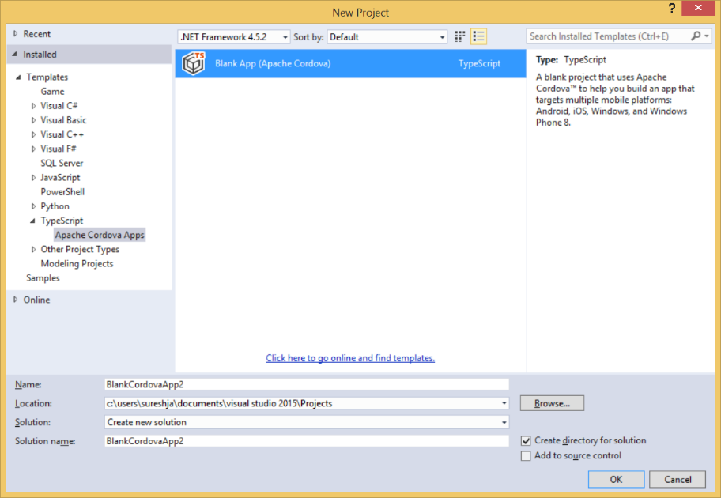
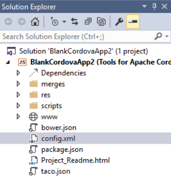
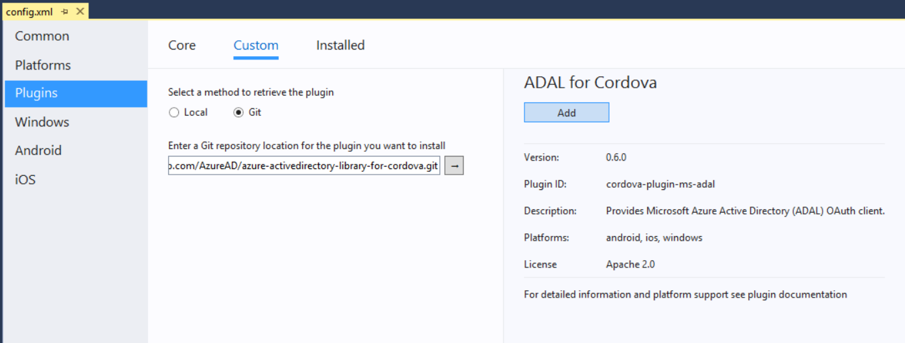
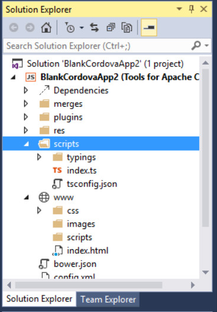
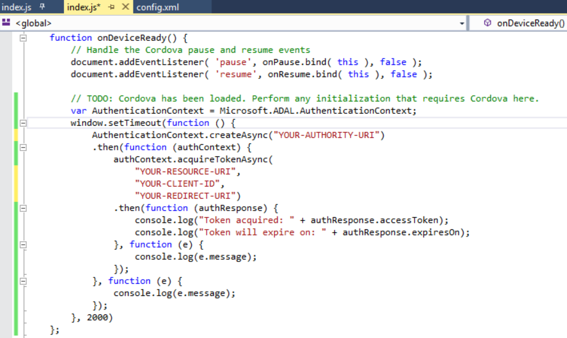
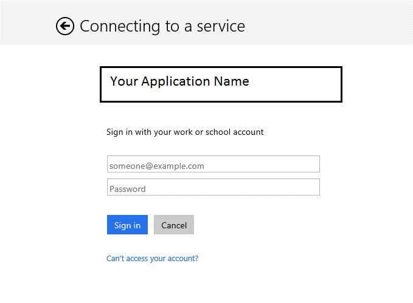

#Using Active Directory Authentication in Cordova Applications

##Overview
The Azure AD Authentication Library (ADAL) for Cordova, a plugin located at:
https://github.com/AzureAD/azure-activedirectory-library-for-cordova, enables client application developers to easily authenticate users to cloud or on-premises Active Directory (AD), and then obtain access tokens for securing API calls. ADAL for Cordova has many features that make authentication easier for developers, such as asynchronous support, a configurable token cache that stores access tokens and refresh tokens, automatic token refresh when an access token expires and a refresh token is available, and more. By handling most of the complexity, ADAL can help a developer focus on business logic in their application and easily secure resources without being an expert on security.

##Step 1 – Configuring an Azure AD Tenant
You will require an Azure account to begin this process. See: https://azure.microsoft.com/en-us/pricing/free-trial/ for details. 
Start by signing in to the Azure management portal and follow these steps:
1.	Click on Active Directory in the left hand nav.
2.	Click the directory tenant where you wish to register the sample application, or create a new one.
3.	Click the Applications tab.
4.	In the drawer at the bottom of the page, click Add.
5.	Click "Add an application my organization is developing".
6.	Enter a friendly name for the application, for example "DirectorySearcherClient", select "Native Client Application". For the purposes of Azure, we are going to treat the Cordova client app as a native client app. Click next.
7.	Enter a Redirect Uri value of your choosing and of form http://MyDirectorySearcherApp. Upon successful authentication, this is where your app is redirected too, to get the tokens.
8.	While still in the Azure portal for your application, click the Configure tab.
9.	Find the Client ID value and copy it as you will need this later when configuring your application. 
10.	In the Permissions to Other Applications configuration section at the bottom, ensure that "Access your organization's directory" and "Enable sign-on and read user's profiles" are selected under "Delegated permissions" for Windows Azure Active Directory. Save the configuration using the Save button at the bottom of the portal.

##Step 2 - Creating a Client Mobile App using Cordova
Starting with Visual Studio 2015, and through the File-New Project dialog, we select the 
TypeScript-Apache Cordova Apps, and use the Blank App template. 

For more details, see: https://msdn.microsoft.com/en-us/library/dn757057(v=vs.140).aspx
This generates the project structure and a project solution for us in Visual Studio, as seen 
in the Solution Explorer. For more details about this structure and what these folders mean, 
visit: https://msdn.microsoft.com/en-us/library/dn757057(v=vs.140).aspx. We are going to use 
TypeScript in our example here, but the same process can be used for a regular JavaScript-based 
app instead.

##Step 3 – Adding Azure AD to your Client App
By selecting the config.xml file in the solution (double-click), Visual Studio provides us a 
‘designer’ view over the file that allows us to select and add ‘Plugins’. We are going to use a 
Cordova plug-in that enables us to add Azure AD to this app.
 
Choose the “Plugins” option in the left of the designer, and select ‘Custom’ from the top-level
menu choices, as shown below. We are using a ‘custom’ plugin for Cordova at this time, as this 
is not a Cordova ‘core’ plugin.

The plugin is hosted in Github, so we need to point the tool at the repository. Select Git from
the options to retrieve the plugin, and type the following address: 
https://github.com/AzureAD/azure-activedirectory-library-for-cordova in the location text-box.

The designer will indicate the details about the plugin for you in the right-hand side of the 
tool, here you’ll see the name of the plugin, its version and license information.
  
Note: The plugin currently is built to work for Cordova platforms 4.3.1 and 5.0.0. You can 
check your Cordova platform version by using the ‘Platforms’ menu choice in the left of the 
designer.

Once you are satisfied that you have the plugin, click the ‘Add’ button to add the plugin and 
register it with your app (in the config.xml file).

##Step 4 – Adding the Authentication Context to your Cordova App
Through the solution explorer, open the file called ‘index.ts’ (a TypeScript file), that is 
located in the ‘scripts’ folder, as shown here.

 
Type the following code snippet in the onDeviceReady function of your app, which is located in 
the index.d.ts file, and replace the authority URI, resource URI, Client Id and Redirect URI. 
The client ID is that you obtained in step 1 above.

The solution shown here, indicates an asynchronous (promise) example. You can also do this 
synchronously if desired, see: 
https://github.com/AzureAD/azure-activedirectory-library-for-cordova for details.

- Authority URI is the gateway, where the request for the token will start.
- Resource URI is the specific URI behind the gateway that the token is being asked for
- Client Id is the ID registered in the portal for this app – step 1.
- Redirect URI is the location within your app that you will pass control to if you require specific handling upon successful authentication, e.g. http://locahost:4400/redirect.html. (note that the port referenced here is the default port Cordova uses). 
 

On successful authentication, you will obtain the token and expiration from the reponse object.
You can make susbsequent API calls, such as REST-based API calls with this token.

##Step 5 – Running Your App and Using Sign-in
Once you have built your application, and you run this app, your end users will be presented 
with a login screen that is consistent with the platform OS. This means that you do not need 
to build a login screen, or worry about device characteristics. The following example shows 
the login screen on a Windows device; the name shown in this example will be that name you 
configured in Azure, see step 1.

##Wrapping It Up
This tutorial shows you how to add Azure Active Directory authentication (via a plugin) to your
Cordova mobile client project within Visual Studio.
 
##Further Resources 
You can obtain more information through: 
https://github.com/AzureAD/azure-activedirectory-library-for-cordova, and abilities to obtain 
tokens silently and from the token cache at: 
https://github.com/AzureAD/azure-activedirectory-library-for-cordova/blob/master/sample/js/index.js

