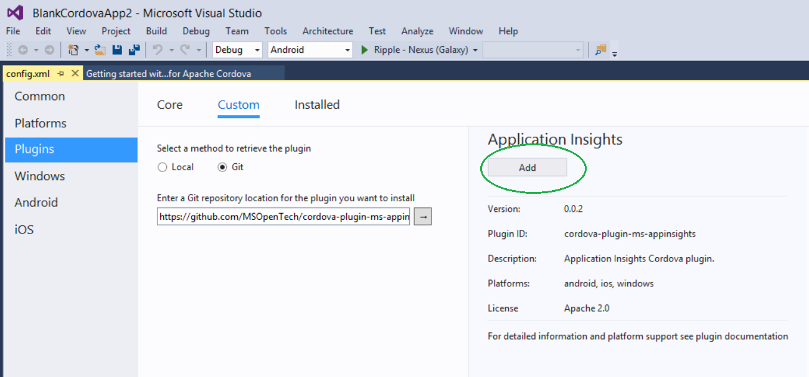

#Using Application Insights in Cordova Applications

##Overview
--- 
[Application Insights](https://azure.microsoft.com/en-us/documentation/articles/app-insights-get-started/) 
helps you, the developer quickly ascertain both issues within your live or in production apps or understand
what your app users are doing within your app. It therefore covers [diagnostics](https://azure.microsoft.com/en-us/documentation/articles/app-insights-detect-triage-diagnose/)
and [telemetry](https://azure.microsoft.com/en-us/documentation/articles/app-insights-overview-usage/).
Application Insights works by adding an SDK that in the case of Cordova adds a plug-in to your app that 
then sends information to the [Azure portal](http://portal.azure.com/). You will need an account with 
Azure, and for more information on getting started with Application Insights refer to the [getting started](https://azure.microsoft.com/en-us/documentation/articles/app-insights-get-started/) 
documentation.This tutorial will demonstrate how to add Application Insights to a Visual Studio Tools for Apache Cordova project.

##Step 1 – Configuring and Creating an Application Insights Resource in Azure
---
We need to create a 'resource' with Azure, which is where the data about our app's performance and 
usage data is displayed. 


* Through the Azure portal, we select *'New'* with the + symbol, select the *'Developer Services'* and 
  choose *'Application Insights'*.

* Name your resource in the Text-box, e.g. we have used 'Contoso' here. This is best named for the given
  application you are creating.

* Choose *'Application Type'*, and *'Other (preview)'* options.
 
* Click on the *'Create'* button. (Note the Application Type options will be removed).

* At this point your resource will be created, and it will open for you in the Azure portal, but the 
  'Essentials' details will be collapsed.
  

 
Open the 'Essentials' area, to see and obtain the 'Instrumentation Id'. This 'id' will be used in your 
client-side application code for Application Insights, and provides the ability for your application to 
connect to your resource.


 
##Step 2 - Creating a Client Mobile App using Cordova
---
Starting with Visual Studio 2015, and through the File-New Project dialog, we select the
*TypeScript-Apache Cordova Apps*, and use the *Blank App* template


For more details, see: https://msdn.microsoft.com/en-us/library/dn757057(v=vs.140).aspx

This generates the project structure and a project solution for us in Visual Studio, 
as seen in the Solution Explorer.  For more details about this structure and what these 
folders mean, visit: https://msdn.microsoft.com/en-us/library/dn757057(v=vs.140).aspx. 

We are going to use TypeScript in our example here, but the same process can be used for 
a regular JavaScript-based app instead.


##Step 3 – Adding the Application Insights Plugin via the 'Plugin Designer'
---
By selecting the config.xml file in the solution (double-click), Visual Studio provides us a 'designer' 
view over the file that allows us to select and add 'Plugins'. We are going to use a Cordova plug-in 
that enables us to add Application Insights to this app. 

The plug-in gives Application Insights the ability to obtain information from the device for diagnostics
information that is pertinent to the app we are creating. (At this time, the ability to get crash 
reporting data from the native portion of the app is not enabled, however, the plugin does provide the 
exception and call-stack information for the JavaScript of the app).

Choose the “Plugins” option in the left of the designer, and select 'Custom' from the top-level menu 
choices, as shown below. We are using a 'custom' plugin for Cordova at this time, as this is not a 
Cordova 'core' plugin.



The plugin is hosted in Github, so we need to point the tool at the repository. Select Git from the 
options to retrieve the plugin, and type the following address: https://github.com/MSOpenTech/cordova-plugin-ms-appinsights.git
in the location text-box.

The designer will indicate the details about the plugin for you in the right-hand side of the tool, here
you'll see the name of the plugin, its version and license information.

*Note: The plugin currently is built to work for Cordova platforms 4.3.1 and 5.0.0. You can check your 
Cordova platform version by using the 'Platforms' menu choice in the left of the designer.*

Once you are satisfied that you have the plugin, click the 'Add' button to add the plugin and register 
it with your app (in the config.xml file).

##Step 4 – Adding the Application Insights Instrumentation Key
---
Through the solution explorer, open the file called 'index.ts' (a TypeScript file), that is located in 
the 'scripts' folder, as shown here. 


We are going to add code to this file to set the instrumentation key, which is the 'Instrumentation Id' 
we obtained in Step 1 above.

First, to get the best help in our code, we will add a reference to the Application Insights intellisense 
file in our code, through a //<reference > tag at the top of the file, as shown here. We can do this 
easily with Visual Studio by opening the location of the d.ts file from the plugins folder. Look under 
the added 'cordova-plugins-ms-appinsights' folder, and the www sub-folder.

Drag and drop the 'AppInsights.d.ts' file over and onto the 'index.ts' file you have open. By releasing 
the mouse button, the reference tag shown here will be automatically opened.


To set the instrumentionKey, we will add code into the 'onDeviceReady' function, below the 'comment' that 
states 'Cordova is loaded. Perform any initialization here'.

Begin by typing 'app', you should see IntelliSense pop up a menu selection. Select 'appInsights', 
type '.', and select 'config', press '.' and select 'instrumentionKey'.

 

Finally set the value of this property against the string value of your instrumentation Id obtained 
previously in Step 1, as shown here:

>```javascript
// TODO: Cordova has been loaded. Perform any initialization that requires Cordova here.
appInsights.config.instrumentationKey = 'YOUR-INSTRUMENTATION-KEY';
appInsights.config.enableDebug = true;
```

##Step 5 – Using Application Insights
---
Once you have configured Application Insights and added it to your application, you can use APIs to define
and track usage information. In this example, we have added the 'trackPageView' function that allows us to
get information about page views.

>```javascript
// This will track a page view
appInsights.trackPageView("Index");
```

Here are a few other examples:

>```javascript
// This will send a custom-defined event to your appInsights account
var eventData = { ButtonId: "trackSingleEvent", Timestamp: new Date() };
appInsights.trackEvent('click', eventData);
// This will send data about how long some action is performed
appInsights.startTrackEvent("longRunningTask");
// Emulate some long-running action through 'setTimeout'
setTimeout(function () {
   // When task is finished, call 'stopTrackEvent' with the same event as in 'startTrackEvent'
   appInsights.stopTrackEvent("longRunningTask");
}, 10000);
// This will send an exception information to your appInsights account
try {
    // Do some logic here which may
    throw new Error("Sample Error");
} catch (err) {
    // Catch an error and send it to appInsights
    appInsights.trackException(err);
}
// Track metric
var queue = [];
appInsights.trackMetric("Queue", queue.length);
```

##Step 6 – Observing Data for your App from Application Insights
---
Once you start running your app, events and data will be sent to Application Insights. You can view this 
data by logging into your azure account through the Azure portal: http://portal.azure.com.  


Select your Application Insights resource, as defined in step 1, you will see the overall dashboard for 
your app. From the dashboard you'll be able to select usage analytics and drill into the data. 
For example, select 'Usage' and in the pop-out blade you will see the user sessions and page views, 
custom events and other data.


You can further drill into the data, by clicking on the events for example. If you are 
experiencing exceptions in your app and have logged this data back to Application Insights, 
you will be able to select the 'Failures' button from the dashboard and drill into the 
exceptions list to get the call-stack that was captured from the exception.

It is possible to gain information about the line numbers and user-agents for example. 

##Wrapping It Up
---
This tutorial shows you how to add Application Insights to your Cordova mobile client project, within Visual Studio, and how to instrument your app to pass data such as diagnostics and telemetry, back to Application Insights for analysis. 

##Further Resources
--- 
You can obtain more information about the APIs available to you for Application Insights [here](https://azure.microsoft.com/en-us/documentation/articles/app-insights-custom-events-metrics-api/#page-views).
